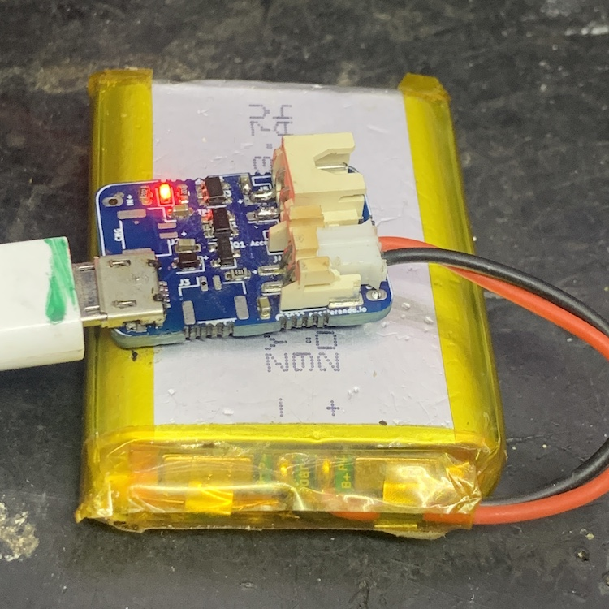
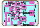
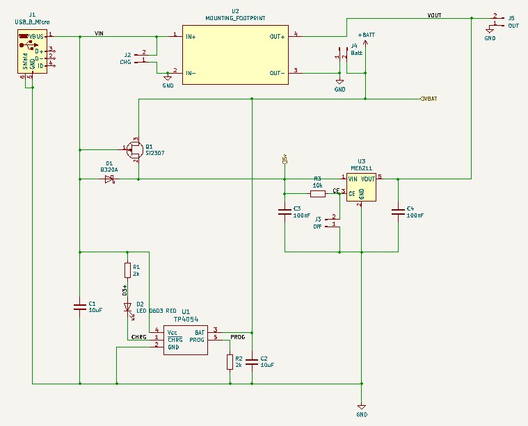

# Figtree - a simple battery maintenance board

This board takes in 4-6v from USB, solar panel or other DC, and charges a lithium battery.

It also delivers regulated 3.3v at up to 600mA.

Basically it is an all in one "Run a microcontroller board off solar and/or battery" hack.

The board has three key connections

  * Charging power in
  * Battery in/out
  * Project power out

There are solder pads for wires, and JST connector footprints for each of these.   You can use one
or the other.  

